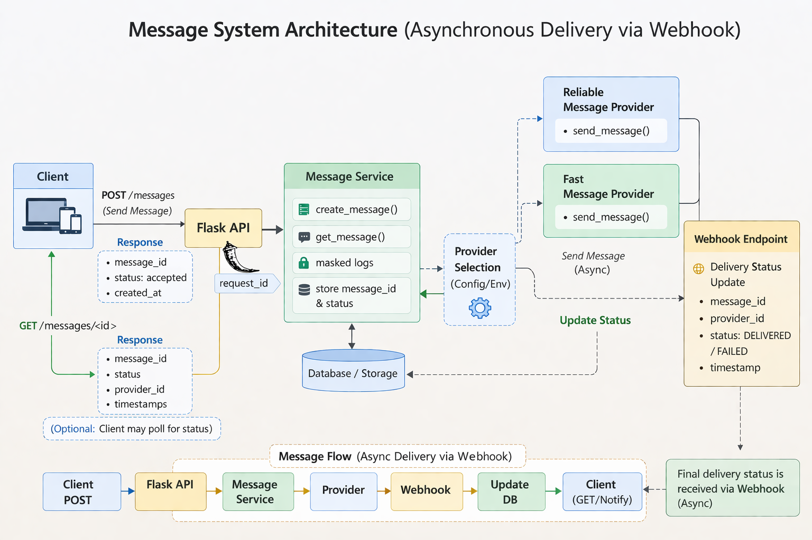

# Messaging API Simulation with Automated API Testing


## Overview
A simulated messaging service demonstrating asynchronous API workflows,
webhook delivery updates, and automated API tests using pytest.


It is designed to focus on:

- API correctness
- Error handling
- Status lifecycle validation
- Webhook simulation
- Test automation using `pytest`


---
## Technologies Used

- Python
- Flask
- pytest
- REST API design
- Dependency Injection
- Automated Testing
---


## Architecture
Client → Flask API → MessageService → FakeProvider
↑
Webhook / delivery update

- `app.py` → Flask API layer  
- `services/message_service.py` → Business logic, message lifecycle  
- `providers/base_provider.py` → Abstract provider interface  
- `providers/fake_provider.py` → Simulated provider behavior  
- `tests/` → Pytest test cases and shared fixtures (`conftest.py`)  

## Architecture Diagram


The diagram below illustrates how the messaging API interacts with the provider and how delivery updates are handled asynchronously.

## Architecture Diagram

<p align="center">
  
</p>
---
## Project Structure

```
communication-messaging-api/
│
├── app.py                      # Flask API endpoints
├── services/
│   └── message_service.py      # Core business logic
│
├── providers/
│   ├── base_provider.py        # Abstract provider interface
│   └── fake_provider.py        # Simulated messaging provider
│
├── tests/
│   ├── conftest.py             # Shared pytest fixtures
│   └── test_messages.py        # API test cases
│
├── docs/
│   └── architecture.png        # System architecture diagram
│
├── requirements.txt
└── README.md

```
## Test Coverage Focus

The automated tests validate:

- API request validation
- Successful message creation
- Handling provider failures
- Message retrieval
- Webhook delivery updates
- Invalid status transitions


## Features Implemented

1. **Message Creation**  
   - POST `/messages`  
   - Validates receiver and content  
   - Sends message to provider (fake)  
   - Returns `201 Created` on success, `400` for invalid input, `503` for provider failure

2. **Message Retrieval**  
   - GET `/messages/<id>`  
   - Returns `200 OK` if message exists, `404 Not Found` otherwise

3. **Webhook / Delivery Update**  
   - POST `/delivery-update`  
   - Simulates provider callback  
   - Updates message status (`SENT → DELIVERED`)  
   - Returns `200 OK`, `404` if provider_id not found, `400` for invalid state transitions

 4.  **Config-Driven Multiple Providers**
- `MessageService` dynamically selects provider(s) based on **config.yaml** or `PROVIDER_NAME` environment variable.  
- Current simulated providers:  
    - `ReliableMessageProvider`  
    - `FastMessageProvider`  
- **Benefit:** easily extend to new providers without changing `MessageService` or tests.

 5. **Logging and Masking**

    - Centralized logger captures:  
        - `request_id` (API request)  
        - `message_id` (individual message)  
        - Provider responses and status updates  
- Sensitive information (e.g., recipient phone number, receiver) is **masked** before logging.  
- Logger is used in:  
  - `MessageService` (all message creation, updates, provider calls)  
  - Each Provider (`send_message`)  
  - Webhook updates  
  - Logs are written to a file with the current date appended to the filename.
- **Benefit:** traceable, secure, and future-ready for production monitoring.
6. **Tests**  
   - Pytest test cases include **xfail** for expected provider failures  
   - Positive and negative scenarios, webhook simulation, status validation  
---

## Status Codes Used

| HTTP Code | Meaning | Where Used |
|-----------|--------|------------|
| 201       | Created successfully | Message created |
| 200       | OK / Success | Get message, webhook update |
| 400       | Bad Request / Invalid input | Invalid phone, empty content, invalid state |
| 404       | Not Found | Message ID or Provider ID does not exist |
| 503       | Service Unavailable | Provider failure simulated |

---

## Installation

1. Clone repository:

```bash
git clone <your-github-repo-url>
cd communication-messaging-api
```

2. Create virtual environment:

```bash
python -m venv venv
source venv/bin/activate   # Linux/Mac
venv\Scripts\activate      # Windows
```

3. Install dependencies:

```bash
pip install -r requirements.txt
```

4. set environment to provider of choice.In future enhancements we set this variable in Jenkins
```
export PROVIDER_NAME=ReliableMessageProvider
or
export PROVIDER_NAME=FastMessageProvider
```
## Running Tests

Run all tests using:

```bash
pytest -v
pytest -v -s 
to get logging information for debugging
```

The test suite includes:

- Positive API tests
- Negative input validation tests
- Webhook simulation tests
- HTTP status code verification


## Possible Future Improvements

- Add message retry mechanism for provider failures
- Add asynchronous queue 
- Add API authentication
- Add  monitoring
- Add CI pipeline using Jenkins or GitHub Actions
- Add test coverage reporting
